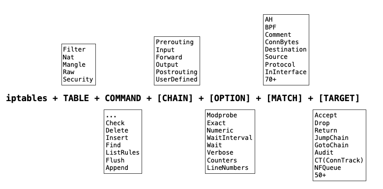

# GO-XTABLES

[](https://pkg.go.dev/badge/github.com/singchia/go-xtables)
[](https://github.com/singchia/go-xtables/actions/workflows/go.yml)
[](https://opensource.org/licenses/Apache-2.0)


## 简介
### 说明
Netfilter允许数据包在多个表和链进行过滤、转换和修改，其内核态通过提供setsockopt和getsockopt的多个socket option给上层以增删改查的能力，但这些socket option因为没有标准定义并不直接开放给开发者，对于c/c++开发者来说，可以考虑```libiptc ```来与netfilter交互，不过据netfilter官方描述，libiptc从不（NEVER）意味着对公众开放。因此对于go开发者来说，使用系统调用封装socket或使用cgo封装libiptc都不是更好的选择，按照netfilter的说明，更建议开发者使用iptables, ebtables和arptables工具来操作数据包。

Go-xtables就是对iptables, ebtables和arptables工具进行了封装，相比较其他库，额外提供ebtables和arptables的能力，全特性支持（对所有在man手册提及的扩展能力进行了封装），对外提供了链式调用和option模式，完整继承了几个tables里对用户的抽象，非常方便。

查看 [iptables godoc](https://pkg.go.dev/github.com/singchia/go-xtables/iptables) 和 [ebtables godoc](https://pkg.go.dev/github.com/singchia/go-xtables/ebtables) 来了解70+ ```match```能力，50+ ```target```能力以10+ ```option```能力。

### 设计



### 特性

* 简单易用
* 多tables支持（iptables, ebtables, arptables）
* 全特性支持（全量matches, options, watchers和其他extensions）
* 链式调用（任意排序，可复用对象）
* Dryrun
* 可控日志（默认日志或logrus等）

## 使用
### 简单使用
#### 拒绝特定端口的所有进入流量
``` 
iptables.NewIPTables().
	Table(iptables.TableTypeFilter).
	Chain(iptables.ChainTypeINPUT).
	MatchProtocol(false, network.ProtocolTCP).
	MatchTCP(iptables.WithMatchTCPDstPort(false, 2432)).
	TargetDrop().
	Append()
```
#### 允许特定源IP地址的所有进入流量
```
iptables.NewIPTables().
	Table(iptables.TableTypeFilter).
	Chain(iptables.ChainTypeINPUT).
	MatchSource(false, "192.168.1.100").
	TargetAccept().
	Append()
```
#### 查找相关的规则
```
rules, err := iptables.NewIPTables().
	Table(iptables.TableTypeFilter).
	Chain(iptables.ChainTypeINPUT).
	MatchSource(false, "192.168.1.100").
	TargetAccept().
	FindRules()
```
#### 删除所有表的所有规则
```
iptables.NewIPTables().Flush()
```
#### 允许每分钟10个连接进入80端口
```
iptables.NewIPTables().
	Table(iptables.TableTypeFilter).
	Chain(iptables.ChainTypeINPUT).
	MatchProtocol(false, network.ProtocolTCP).
	MatchTCP(iptables.WithMatchTCPDstPort(false, 80)).
	MatchLimit(iptables.WithMatchLimit(xtables.Rate{10, xtables.Minute})).
	TargetAccept().
	Append()
```
#### 流量镜像到网关
```
iptables.NewIPTables().
	Table(iptables.TableTypeMangle).
	Chain(iptables.ChainTypePREROUTING).
	MatchProtocol(false, network.ProtocolTCP).
	MatchTCP(iptables.WithMatchTCPDstPort(false, 2432)).
	TargetTEE(net.ParseIP("192.168.1.1")).
	Insert()
```
#### 拒绝特定MAC地址的访问

该示例使用ebtables，请注意该规则作用在```linux-bridge```上，请先确保网卡被bridge接管。

```
ebtables.NewEBTables().
	Table(ebtables.TableTypeFilter).
	Chain(ebtables.ChainTypeINPUT).
	MatchSource(false, "00:11:22:33:44:55").
	TargetDrop().
	Append()
```
### 现实场景
#### 防止DDos攻击
```
custom := "SYN_FLOOD"
ipt := iptables.NewIPTables().Table(iptables.TableTypeFilter)
ipt.NewChain(custom)
ipt.Chain(iptables.ChainTypeINPUT).
	MatchProtocol(false, network.ProtocolTCP).
	MatchTCP(iptables.WithMatchTCPSYN(false)).
	TargetJumpChain(custom).
	Append()

userDefined := iptables.ChainTypeUserDefined
userDefined.SetName(custom)
rate := xtables.Rate{1, xtables.Second}
ipt.Chain(userDefined).
	MatchLimit(
		iptables.WithMatchLimit(rate),
		iptables.WithMatchLimitBurst(3)).
	TargetReturn().
	Append()
ipt.Chain(userDefined).
	TargetDrop().
	Append()
```
#### 禁PING
```
iptables.NewIPTables().
	Table(iptables.TableTypeFilter).
	Chain(iptables.ChainTypeINPUT).
	MatchProtocol(false, network.ProtocolICMP).
	MatchICMP(false, network.ICMPType(network.EchoRequest)).
	TargetDrop().
	Append()
```
#### 流量只进不出
```
ipt := iptables.NewIPTables().Table(iptables.TableTypeFilter)
ipt.Chain(iptables.ChainTypeINPUT).
	MatchInInterface(false, "lo").
	TargetAccept().
	Append()
ipt.Chain(iptables.ChainTypeINPUT).
	MatchState(iptables.ESTABLISHED | iptables.RELATED).
	TargetAccept().
	Append()
ipt.Chain(iptables.ChainTypeINPUT).
	MatchProtocol(false, network.ProtocolTCP).
	MatchTCP(iptables.WithMatchTCPDstPort(false, 22)).
	TargetAccept().
	Append()
ipt.Chain(iptables.ChainTypeINPUT).Policy(iptables.TargetTypeDrop)
ipt.Chain(iptables.ChainTypeFORWARD).Policy(iptables.TargetTypeDrop)
ipt.Chain(iptables.ChainTypeOUTPUT).Policy(iptables.TargetTypeAccept)
```
## 注意

### 兼容性
从Linux内核版本4.18开始，nftables成为内核的一部分，并逐步替代iptables。因此，使用linux 4.18以及更高版本的发行版通常会使用nftables而不是iptables。由于nftables并不完全兼容iptables，如果还想要继续使用go-xtables，在使用这些发行版时最好能够切换到iptables以继续使用。

以下发行版需要注意兼容性：

* Debian 10(Buster) 及更高版本
* Ubuntu 18.04(Bionic Beaver) 及更高版本
* Centos 8 及更高版本
* Fedora 18 及更高版本
* OpenSUSE Leap 15.2 及更高版本
* Arch Linux

## 参与开发
 当前go-xtables处于能力验证阶段（POC），如果你发现任何Bug，请随意提出Issue，项目Maintainers会及时响应相关问题。
 
 如果你希望能够提交Feature，更快速解决项目问题，满足以下简单条件下欢迎提交PR：
 
 * 代码风格保持一致
 * 每次提交一个Feature
 * 提交的代码都携带单元测试
 * 通过CI构建

在满足以上条件后，经过Code review没问题，就会合入代码。

## 许可证

© Austin Zhai, 2022-2025

Released under the [Apache License 2.0](https://github.com/singchia/go-xtables/blob/master/License)

